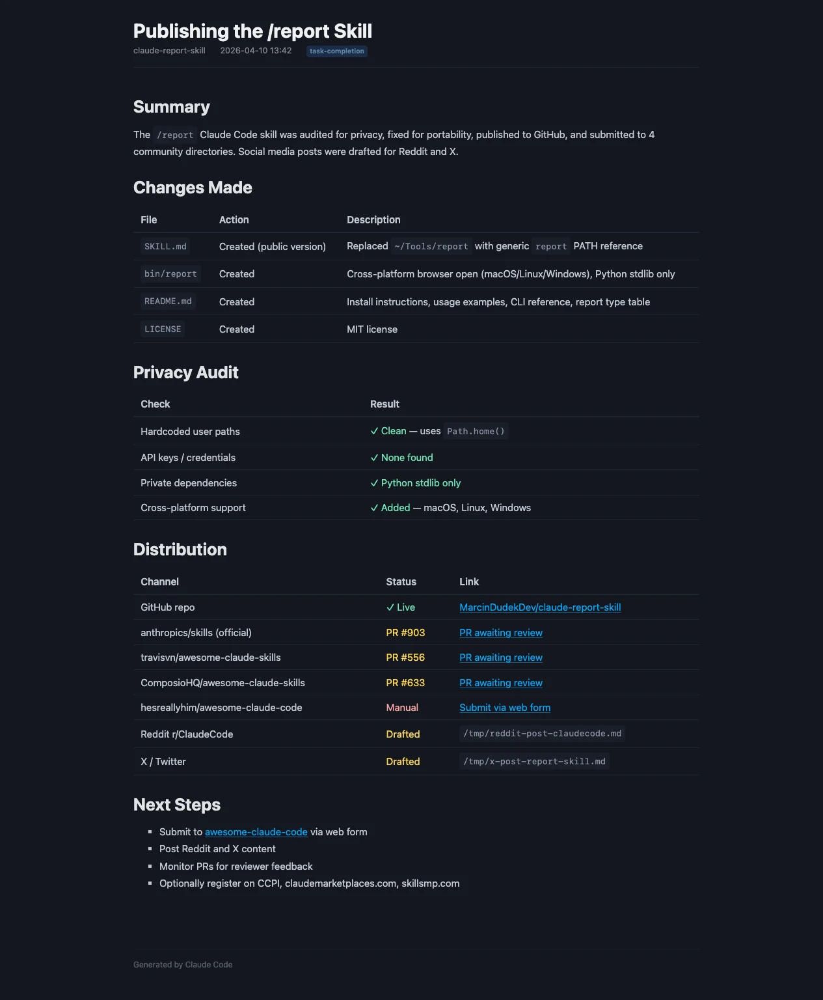

# /report — Claude Code Skill

A Claude Code skill that generates beautiful, self-contained HTML reports instead of dumping long output into your terminal.

When Claude's response would exceed ~10 lines — research findings, audit results, task summaries, comparisons — it automatically generates a styled HTML report and opens it in your browser.

## What it does

- **Auto-triggers** when output would be long (>10 lines) or when you type `/report`
- **5 report types**: task-completion, research, audit, error-blocker, comparison
- **Dark-themed** with [PicoCSS](https://picocss.com) — clean, readable, professional
- **Indexed** — every report gets JSON metadata for search and dashboards
- **Self-contained** — each report is a single HTML file, no build step
- **Zero dependencies** — Python stdlib only

## Example

Instead of a wall of terminal text, you get this:



See the full HTML: **[examples/example-task-completion.html](examples/example-task-completion.html)** (download and open in browser).

```
Report: Security Audit Results → ~/claude-reports/myproject/2026-04-10/143022-security-audit-results.html
```

The report opens in your browser with structured sections, pass/fail tables, color-coded badges, and collapsible details.

## Install

### 1. Add the skill to Claude Code

Copy the `SKILL.md` file to your Claude Code skills directory:

```bash
mkdir -p ~/.claude/skills/report
cp SKILL.md ~/.claude/skills/report/
```

### 2. Install the CLI tool

The `bin/report` script handles file paths, indexing, and opening reports. Add it to your PATH:

```bash
cp bin/report ~/.local/bin/report
chmod +x ~/.local/bin/report
```

Or symlink it:

```bash
ln -s "$(pwd)/bin/report" ~/.local/bin/report
```

Make sure `~/.local/bin` is in your PATH.

### 3. Verify

```bash
report --help
```

## Usage

Just use Claude Code normally. The skill triggers automatically when appropriate.

You can also explicitly request a report:

```
/report
```

Or ask Claude to generate a specific type:

```
"Audit this codebase for security issues"     → audit report
"Compare React vs Svelte for this project"    → comparison report
"What did you change?"                         → task-completion report
"Research the best CI/CD options"              → research report
```

## Report types

| Type | Sections | When to use |
|------|----------|-------------|
| `task-completion` | Summary, Changes Made, Verification, Next Steps | After implementing something |
| `research` | Key Findings, Analysis, Recommendations, Sources | Research and investigation |
| `audit` | Score, Pass/Fail Table, Findings, Recommendations | Quality/security/perf checks |
| `error-blocker` | What's Blocked, Root Cause, Action Items, Workarounds | When something is broken |
| `comparison` | Options Table, Detailed Analysis, Recommendation | Evaluating alternatives |

## Where reports go

```
~/claude-reports/
  ├── index.json              # Auto-maintained index of all reports
  ├── myproject/
  │   └── 2026-04-10/
  │       ├── 143022-security-audit.html
  │       └── 150511-api-research.html
  └── another-project/
      └── ...
```

## CLI reference

```bash
# Generate a file path for a new report
report --path --project "myproject" --title "Security Audit" --type audit

# Open a report in browser (also indexes it)
report --open ~/claude-reports/myproject/2026-04-10/143022-security-audit.html

# List recent reports (JSON)
report --list
report --list --project myproject --type audit --days 7

# Rebuild the index from disk
report --index
```

## Platform support

- **macOS**: Uses `open` to launch browser
- **Linux**: Uses `xdg-open` to launch browser
- **Windows**: Uses `os.startfile` to launch browser

## License

MIT
